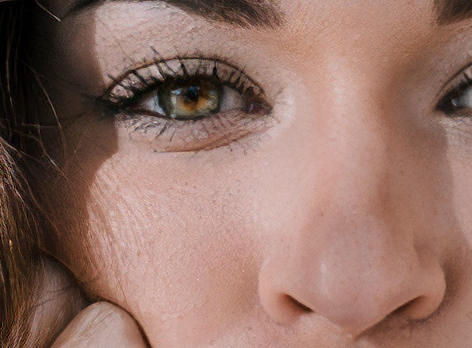
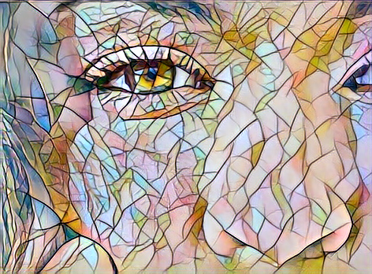

# Neural-Style 神经网络风格迁移

## 1 环境准备

- 本程序需要安装[PyTorch](https://pytorch.org/)
- 还需要通过`pip install -r requirements.txt` 安装其它依赖


##2  数据准备

本试验使用的数据来自coco，你也可以使用其它数据，比如ImageNet。请尽量保证数据的多样性，**不建议**使用单一种类的数据集，比如LSUN或者人脸识别数据集之类的。

请确保所有的图片保存于`data/coco/`文件夹下,形如：
```Bash
data
 └─ coco
    ├── COCO_train2014_000000000009.jpg
    ├── COCO_train2014_000000000025.jpg
    ├── COCO_train2014_000000000030.jpg
```

## 用法
如果想要使用visdom可视化，请先运行`python2 -m visdom.server`启动visdom服务
基本用法：
```
Usage： python main.py FUNCTION --key=value,--key2=value2 ..
```

- 训练
```bash
python main.py train --use-gpu=False --data-root=data --batch-size=2
```

- 生成图片

读者可以[点此](http://pytorch-1252820389.cosbj.myqcloud.com/transformer.pth)下载预训练的模型`transformer.pth`，
```bash
python main.py stylize  --model-path='transformer.pth' \
                 --content-path='amber.jpg'\ 
                 --result-path='output2.png'\ 
                 --use-gpu=False
```
完整的选项及默认值
```python
    image_size = 256 # 图片大小
    batch_size = 8
    data_root = 'data/' # 数据集存放路径：data/coco/a.jpg
    num_workers = 4 # 多线程加载数据
    use_gpu = True # 使用GPU
    
    style_path= 'style.jpg' # 风格图片存放路径
    lr = 1e-3 # 学习率

    env = 'neural-style' # visdom env
    plot_every=10 # 每10个batch可视化一次

    epoches = 2 # 训练epoch

    content_weight = 1e5 # content_loss 的权重 
    style_weight = 1e10 # style_loss的权重

    model_path = None # 预训练模型的路径
    debug_file = '/tmp/debugnn' # touch $debug_fie 进入调试模式 

    content_path = 'input.png' # 需要进行风格迁移的图片
    result_path = 'output.png' # 风格迁移结果的保存路径
   
```
部分风格迁移的结果：





如果需要训练其它风格的图片，只需要修改`--style-path`对应的风格图片。

### 兼容性测试
train 
- [x] GPU
- [x] CPU 
- [x] Python2
- [x] Python3

test: 

- [x] GPU
- [x] CPU
- [x] Python2
- [x] Python3